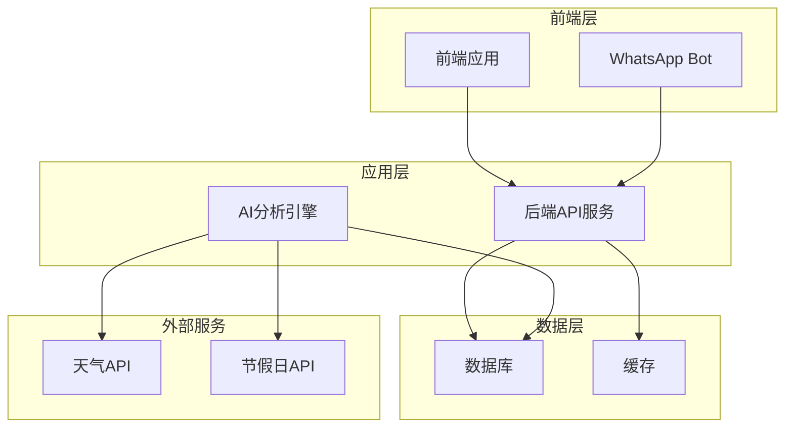
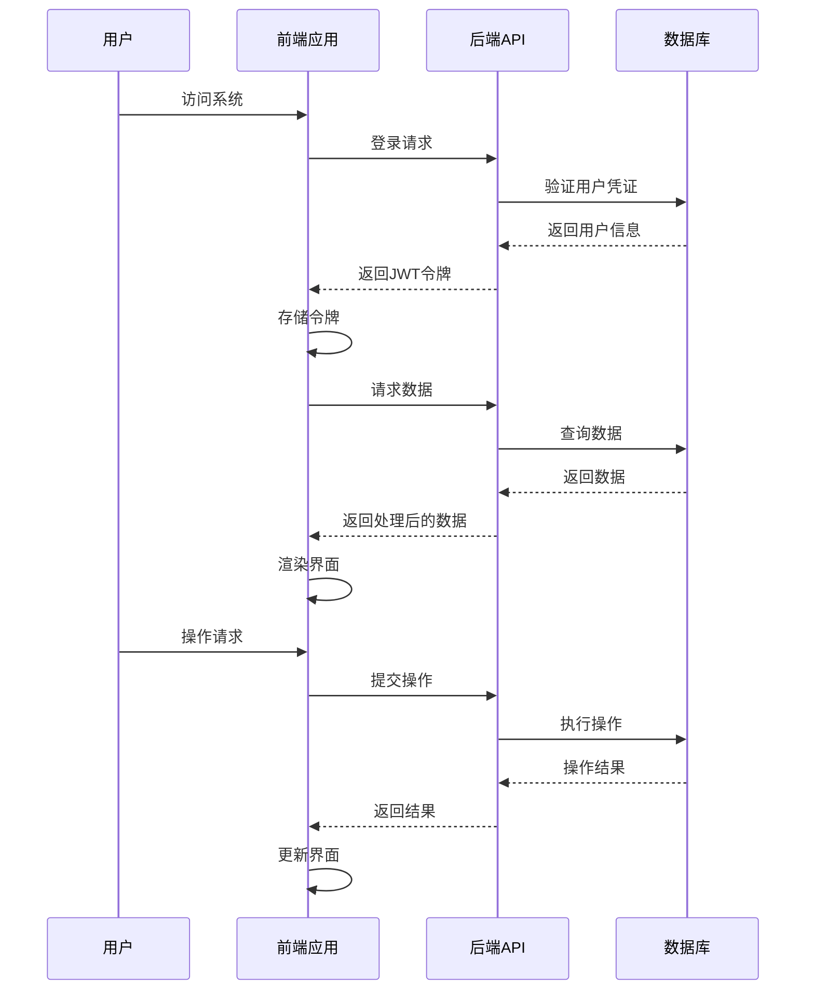
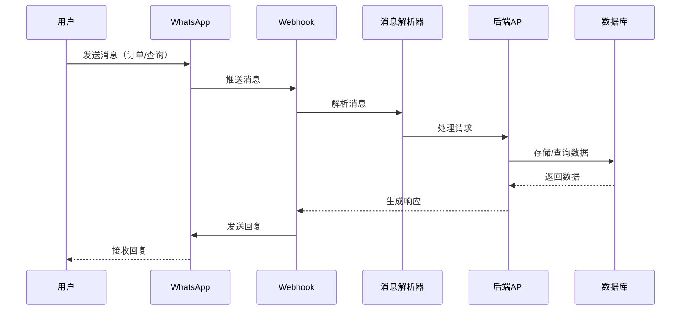
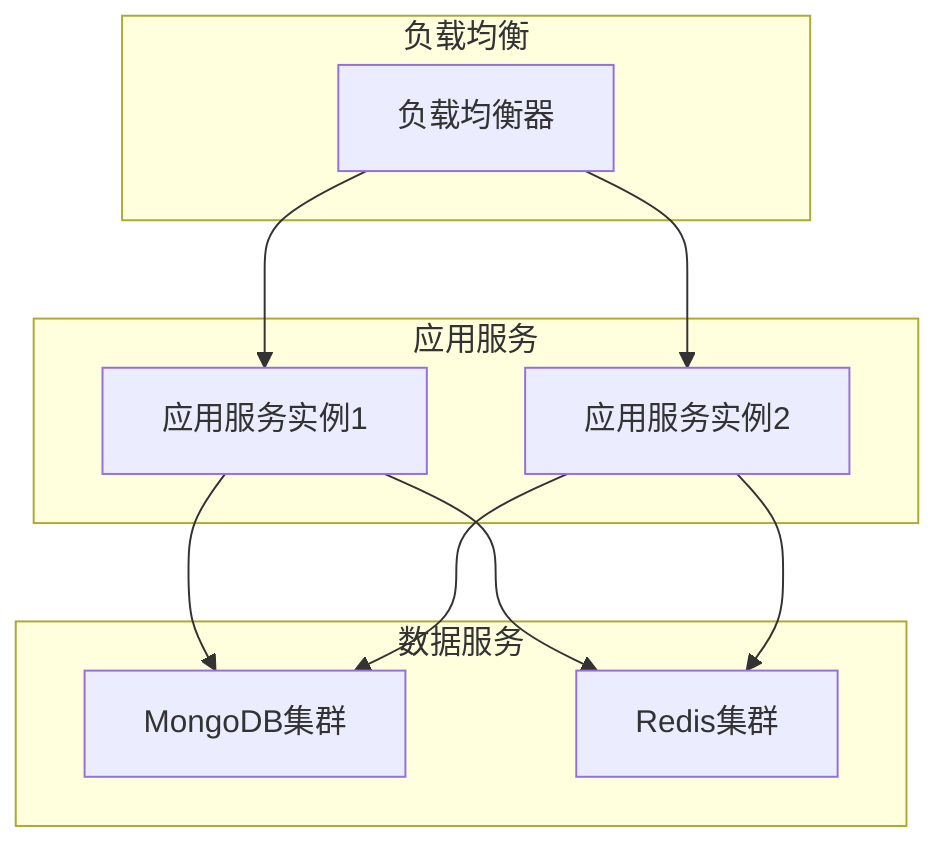

# X-Motors 供应链看板系统架构设计

## 1. 系统架构概览

### 1.1 整体架构



### 1.2 技术栈选择

| 层次 | 技术 | 版本 | 选型理由 |
|------|------|------|----------|
| 前端 | HTML5, CSS3, JavaScript | - | 基于现有代码基础，保持兼容性 |
| 前端框架 | 原生JavaScript + Chart.js | - | 轻量级实现，易于集成 |
| 后端 | Node.js + Express | 18.x | 高性能、轻量级，适合构建API服务 |
| 数据库 | MongoDB | 6.x | 灵活的数据结构，适合存储复杂的供应链数据 |
| 缓存 | Redis | 7.x | 用于缓存热点数据和会话管理 |
| 认证 | JWT | - | 无状态认证，便于水平扩展 |

## 2. 前端架构

### 2.1 模块划分

| 模块 | 功能描述 | 文件位置 |
|------|----------|----------|
| 核心布局 | 系统主框架、导航、权限控制 | `src/layout/` |
| 仪表盘 | 数据总览、KPI指标 | `src/pages/dashboard/` |
| 库存管理 | 库存状态、预警、操作 | `src/pages/inventory/` |
| 采购申请 | 申请提交、审批流程 | `src/pages/orders/` |
| 物流追踪 | 物流状态、异常处理 | `src/pages/logistics/` |
| 销售分析 | 销售数据、趋势分析 | `src/pages/sales/` |
| 加盟商管理 | 绩效分析、目标达成 | `src/pages/franchise/` |
| AI预测 | 需求预测、智能分析 | `src/pages/ai-forecast/` |
| 业务建议 | 智能建议、优化方案 | `src/pages/recommendations/` |
| 运营分析 | 运营指标、效率分析 | `src/pages/operations/` |
| 发票管理 | 发票创建、账期管理 | `src/pages/invoices/` |
| 加盟商门户 | 个人销售、采购申请 | `src/pages/franchise-portal/` |

### 2.2 前端数据流



## 3. 后端架构

### 3.1 模块划分

| 模块 | 功能描述 | 文件位置 |
|------|----------|----------|
| 认证模块 | 用户认证、权限管理 | `server/auth/` |
| 订单模块 | 订单处理、状态管理 | `server/modules/orders/` |
| 库存模块 | 库存管理、预警逻辑 | `server/modules/inventory/` |
| 物流模块 | 物流追踪、状态更新 | `server/modules/logistics/` |
| 销售模块 | 销售数据分析、报表 | `server/modules/sales/` |
| 加盟商模块 | 加盟商管理、绩效分析 | `server/modules/franchise/` |
| 发票模块 | 发票管理、账期追踪 | `server/modules/invoices/` |
| AI模块 | 需求预测、智能分析 | `server/modules/ai/` |
| WhatsApp模块 | Bot集成、消息处理 | `server/modules/whatsapp/` |

### 3.2 API 设计

| API路径 | 方法 | 功能描述 | 权限要求 |
|---------|------|----------|----------|
| `/api/auth/login` | POST | 用户登录 | 公共 |
| `/api/auth/refresh` | POST | 刷新令牌 | 已认证 |
| `/api/orders` | GET | 获取订单列表 | 已认证 |
| `/api/orders` | POST | 创建订单 | 已认证 |
| `/api/orders/:id` | PUT | 更新订单状态 | 管理员/运营 |
| `/api/inventory` | GET | 获取库存列表 | 已认证 |
| `/api/inventory/:id` | PUT | 更新库存状态 | 管理员/运营 |
| `/api/logistics` | GET | 获取物流列表 | 已认证 |
| `/api/logistics/:id` | PUT | 更新物流状态 | 管理员/运营 |
| `/api/sales` | GET | 获取销售数据 | 管理员/市场 |
| `/api/franchise` | GET | 获取加盟商列表 | 管理员/市场 |
| `/api/franchise/:id` | GET | 获取加盟商详情 | 管理员/市场 |
| `/api/invoices` | GET | 获取发票列表 | 已认证 |
| `/api/invoices` | POST | 创建发票 | 管理员 |
| `/api/invoices/:id` | PUT | 更新发票状态 | 管理员/加盟商 |
| `/api/ai/forecast` | GET | 获取AI预测数据 | 管理员/市场 |
| `/api/whatsapp/webhook` | POST | WhatsApp消息接收 | 公共 |

## 4. 数据库架构

### 4.1 数据模型

#### 用户表 (`users`)
| 字段名 | 数据类型 | 描述 |
|--------|----------|------|
| `_id` | ObjectId | 用户ID |
| `username` | String | 用户名 |
| `password` | String | 密码哈希 |
| `role` | String | 角色（admin/ops/marketing/franchise） |
| `franchiseId` | ObjectId | 加盟商ID（仅加盟商角色） |
| `createdAt` | Date | 创建时间 |
| `updatedAt` | Date | 更新时间 |

#### 加盟商表 (`franchisees`)
| 字段名 | 数据类型 | 描述 |
|--------|----------|------|
| `_id` | ObjectId | 加盟商ID |
| `name` | String | 加盟商名称 |
| `contact` | String | 联系方式 |
| `address` | String | 地址 |
| `risk` | String | 风险等级 |
| `nov` | Number | 11月销售额 |
| `dec` | Number | 12月销售额 |
| `jan` | Number | 1月销售额 |
| `feb` | Number | 2月销售额 |
| `mar_pred` | Number | 3月预测销售额 |
| `createdAt` | Date | 创建时间 |
| `updatedAt` | Date | 更新时间 |

#### 订单表 (`orders`)
| 字段名 | 数据类型 | 描述 |
|--------|----------|------|
| `_id` | ObjectId | 订单ID |
| `store` | String | 门店名称 |
| `product` | String | 产品名称 |
| `qty` | Number | 数量 |
| `date` | Date | 订单日期 |
| `status` | String | 状态（pending/approved/rejected） |
| `createdAt` | Date | 创建时间 |
| `updatedAt` | Date | 更新时间 |

#### 库存表 (`inventory`)
| 字段名 | 数据类型 | 描述 |
|--------|----------|------|
| `_id` | ObjectId | 库存ID |
| `product` | String | 产品名称 |
| `category` | String | 品类 |
| `stock` | Number | 库存数量 |
| `minStock` | Number | 最小库存阈值 |
| `price` | Number | 单价 |
| `status` | String | 状态（normal/low/critical） |
| `createdAt` | Date | 创建时间 |
| `updatedAt` | Date | 更新时间 |

#### 物流表 (`logistics`)
| 字段名 | 数据类型 | 描述 |
|--------|----------|------|
| `_id` | ObjectId | 物流ID |
| `trackingId` | String |  tracking号码 |
| `store` | String | 目标门店 |
| `status` | String | 状态（pending/transit/delivered/exc） |
| `eta` | Date | 预计到达时间 |
| `events` | Array | 物流事件历史 |
| `createdAt` | Date | 创建时间 |
| `updatedAt` | Date | 更新时间 |

#### 发票表 (`invoices`)
| 字段名 | 数据类型 | 描述 |
|--------|----------|------|
| `_id` | ObjectId | 发票ID |
| `invoiceId` | String | 发票号码 |
| `franchisee` | String | 加盟商名称 |
| `amount` | Number | 金额 |
| `issueDate` | Date | 开票日期 |
| `dueDate` | Date | 到期日期 |
| `status` | String | 状态（pending/overdue/paid/reminder_sent） |
| `notes` | String | 备注 |
| `createdAt` | Date | 创建时间 |
| `updatedAt` | Date | 更新时间 |

#### 预测表 (`forecasts`)
| 字段名 | 数据类型 | 描述 |
|--------|----------|------|
| `_id` | ObjectId | 预测ID |
| `product` | String | 产品名称 |
| `month` | String | 预测月份 |
| `forecast` | Number | 预测需求量 |
| `confidence` | Number | 预测置信度 |
| `factors` | Object | 影响因素 |
| `createdAt` | Date | 创建时间 |
| `updatedAt` | Date | 更新时间 |

## 5. AI 分析引擎

### 5.1 预测模型

```javascript
// 简化的预测模型伪代码
function predictDemand(product, months = 3) {
  // 1. 获取历史销售数据
  const historicalData = getHistoricalSales(product);
  
  // 2. 获取外部因素（天气、节假日）
  const weatherData = getWeatherData();
  const holidayData = getHolidayData();
  
  // 3. 特征工程
  const features = engineerFeatures(historicalData, weatherData, holidayData);
  
  // 4. 模型预测
  const predictions = model.predict(features);
  
  // 5. 结果处理
  return formatPredictions(predictions);
}
```

### 5.2 异常检测

```javascript
// 异常检测逻辑
function detectAnomalies(data) {
  // 1. 计算统计指标
  const mean = calculateMean(data);
  const stdDev = calculateStdDev(data);
  
  // 2. 检测异常值
  const anomalies = data.filter(value => {
    return Math.abs(value - mean) > 2 * stdDev;
  });
  
  return anomalies;
}
```

## 6. WhatsApp Bot 集成

### 6.1 消息处理流程



### 6.2 消息类型处理

| 消息类型 | 处理逻辑 | 响应内容 |
|----------|----------|----------|
| 订单请求 | 解析产品、数量 → 创建订单 | 订单确认信息 |
| 库存查询 | 查询产品库存状态 | 库存数量、价格 |
| 物流查询 | 查询tracking号码状态 | 物流当前状态、ETA |
| 发票查询 | 查询未付发票 | 发票列表、到期日 |
| 其他问题 | 通用回复或转人工 | 帮助信息 |

## 7. 部署架构

### 7.1 本地开发环境

| 服务 | 端口 | 描述 |
|------|------|------|
| 前端 | 3000 | 静态文件服务器 |
| 后端 | 8000 | API服务 |
| MongoDB | 27017 | 数据库 |
| Redis | 6379 | 缓存 |

### 7.2 生产环境



## 8. 安全架构

### 8.1 认证与授权

- **认证**：使用JWT令牌进行无状态认证
- **授权**：基于角色的访问控制（RBAC）
- **密码安全**：使用bcrypt进行密码哈希
- **API保护**：所有API端点（除登录外）均需验证JWT

### 8.2 数据安全

- **数据加密**：敏感数据加密存储
- **数据库安全**：行级安全策略，确保用户只能访问自己的数据
- **输入验证**：所有用户输入进行严格验证
- **SQL注入防护**：使用参数化查询

### 8.3 通信安全

- **HTTPS**：所有通信使用HTTPS
- **CORS**：合理配置CORS策略
- **CSRF防护**：实现CSRF令牌验证

## 9. 性能优化

### 9.1 前端优化

- **资源压缩**：HTML、CSS、JavaScript压缩
- **图片优化**：使用适当的图片格式和尺寸
- **代码分割**：按需加载模块
- **缓存策略**：合理设置缓存头

### 9.2 后端优化

- **数据库索引**：为常用查询字段创建索引
- **查询优化**：避免全表扫描，使用分页
- **缓存**：热点数据缓存
- **异步处理**：非关键操作异步执行

### 9.3 系统优化

- **负载均衡**：分布式部署
- **水平扩展**：根据负载自动扩展
- **监控**：实时监控系统性能
- **日志**：详细的系统日志

## 10. 扩展性设计

### 10.1 模块扩展

- **插件系统**：支持功能插件
- **API版本控制**：平滑升级API
- **微服务架构**：核心功能微服务化

### 10.2 数据扩展

- **数据分片**：大规模数据分片存储
- **数据备份**：定期数据备份
- **数据迁移**：支持数据迁移工具

### 10.3 功能扩展

- **第三方集成**：支持与其他系统集成
- **自定义报表**：支持自定义报表生成
- **多语言支持**：国际化设计

## 11. 开发与部署流程

### 11.1 开发流程

1. **需求分析**：分析业务需求
2. **架构设计**：设计系统架构
3. **代码开发**：按模块开发
4. **测试**：单元测试、集成测试
5. **代码审查**：代码质量检查
6. **部署**：部署到测试环境
7. **验收**：业务验收测试
8. **发布**：部署到生产环境

### 11.2 部署流程

1. **构建**：构建前端和后端代码
2. **测试**：运行自动化测试
3. **部署**：部署到生产环境
4. **监控**：监控系统运行状态
5. **回滚**：如有问题，执行回滚

## 12. 维护与支持

### 12.1 监控系统

- **健康检查**：定期检查系统健康状态
- **性能监控**：监控系统性能指标
- **错误监控**：实时捕获和处理错误

### 12.2 故障处理

- **故障检测**：自动检测系统故障
- **故障隔离**：隔离故障影响范围
- **故障恢复**：自动或手动恢复系统

### 12.3 技术支持

- **文档**：详细的技术文档
- **知识库**：常见问题解答
- **支持渠道**：技术支持联系方式

## 13. 总结

本架构设计提供了一个完整的X-Motors供应链看板系统解决方案，包括前端、后端、数据库和AI分析引擎。系统采用现代化的技术栈，具有良好的扩展性、安全性和性能。通过WhatsApp Bot集成，实现了多渠道数据采集和交互，提升了系统的实用性和用户体验。

系统架构设计考虑了未来的扩展性和维护性，为后续的功能迭代和技术升级提供了良好的基础。